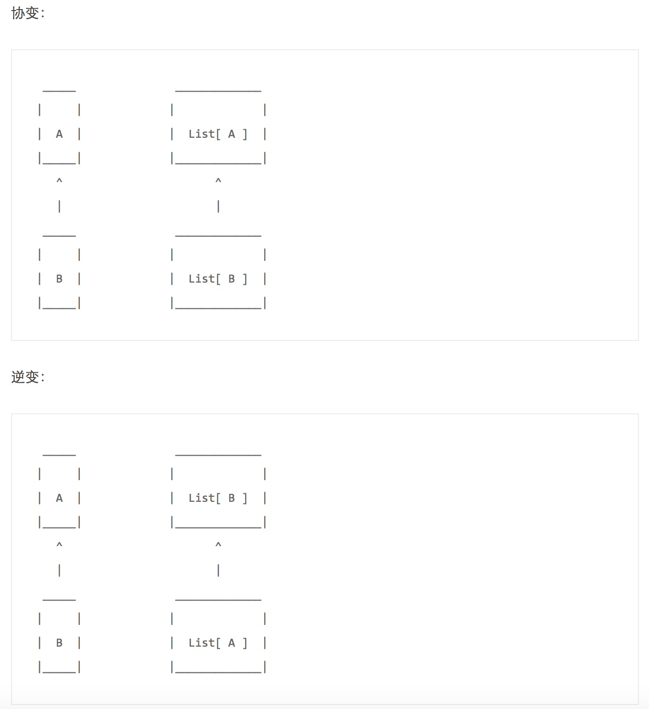

当我们定义一个协变类型List[A+]时，List[Child]可以是List[Parent]的子类型。
当我们定义一个逆变类型List[-A]时，List[Child]可以是List[Parent]的父类型。

##Scala的协变

看下面的例子：
```scala
    class Animal {}
    class Bird extends Animal {}
    class Animal {}
    class Bird extends Animal {}
    //协变
    class Covariant[T](t:T){}
    val cov = new Covariant[Bird](new Bird)
    val cov2:Covariant[Animal] = cov
```
c不能赋值给c2，因为Covariant定义成不变类型。

稍微改一下：
```scala
    class Animal {}
    class Bird extends Animal {}
    class Animal {}
    class Bird extends Animal {}
    //协变
    class Covariant[+T](t:T){}
    val cov = new Covariant[Bird](new Bird)
    val cov2:Covariant[Animal] = cov
```
因为Consumer定义成协变类型的，所以Covariant[Bird]是Covariant[Animal]的子类型，所以它可以被赋值给c2。

##Scala的逆变

将上面的例子改一下：
```scala
    class Animal {}
    class Bird extends Animal {}
    class Contravariant[-T](t: T) {
    }
    val c: Contravariant[Animal] = new Contravariant[Animal](new Animal)
    val c2: Contravariant[Bird] = c
```
这里Consumer[-T]定义成逆变类型，所以Contravariant[Animal]被看作Contravariant[Animal]的子类型，故c可以被赋值给c2。

##下界lower bounds

如果协变类包含带类型参数的方法时：
```scala
    class Animal {}
    class Bird extends Animal {}
    class Consumer[+T](t: T) {
     	def use(t: T) = {}
    }
```
编译会出错。出错信息为 "Covariant type T occurs in contravariant position in type T of value t"。
但是如果返回结果为类型参数则没有问题。
```scala
    class Animal {}
    class Bird extends Animal {}
    class Consumer[+T](t: T) {
     	def get(): T = {new T}
    }
```
为了在方法的参数中使用类型参数，你需要定义下界：
```scala
    class Animal {}
    class Bird extends Animal {}
    class Consumer[+T](t: T) {
    	def use[U >: T](u : U) = {println(u)}
    }
```
这个地方比较复杂, 简单的说就是Scala内部实现是, 把类中的每个可以放类型的地方都做了分类(+, –, 中立), 具体分类规则不说了 对于这里最外层类[+T]是协变, 但是到了方法的类型参数时, 该位置发生了翻转, 成为-逆变的位置, 所以你把T给他, 就会报错说你把一个协变类型放到了一个逆变的位置上

所以这里的处理的方法就是, 他要逆变, 就给他个逆变, 使用[U >: T], 其中T为下界, 表示T或T的超类, 这样Scala编译器就不报错了
##上界upper bounds

看一下逆变类中使用上界的例子：
```scala
    class Animal {}
    class Bird extends Animal {}
    class Consumer[-T](t: T) {
    	def get[U <: T](): U = {new U}
    }
```
可以看到方法的返回值是协变的位置，方法的参数是逆变的位置。
因此协变类的类型参数可以用在方法的返回值的类型，在方法的参数类型上必须使用下界绑定 >:。
逆变类的类型参数可以用在方法的参数类型上，用做方法的返回值类型时必须使用上界绑定 <:。

综合协变，逆变，上界，下界

一个综合例子：
```scala
    class Animal {}
    class Bird extends Animal {}
    class Consumer[-S,+T]() {
    	def m1[U >: T](u: U): T = {new T} //协变，下界
    	def m2[U <: S](s: S): U = {new U} //逆变，上界
    }
    class Test extends App {
    	val c:Consumer[Animal,Bird] = new Consumer[Animal,Bird]()
    	val c2:Consumer[Bird,Animal] = c
    	c2.m1(new Animal)
    	c2.m2(new Bird)
    }
```
##View Bound <%

Scala还有一种视图绑定的功能，如
```scala
    class Bird {def sing = {}}
    class Toy {}
    class Consumer[T <% Bird]() {
	    def use(t: T) = t.sing
    }
```
或者类型参数在方法上：
```scala
    class Bird {def sing = {}}
    class Toy {}
    class Consumer() {
    	def use[T <% Bird](t: T) = t.sing
    }
    class Test extends App {
	    val c = new Consumer()
	    c.use(new Toy)
    }
```
它要求T必须有一种隐式转换能转换成Bird,也就是 T => Bird,否则上面的代码会编译出错：
No implicit view available from Toy => Bird.
加入一个隐式转换，编译通过。
```scala
    import scala.language.implicitConversions
    class Bird {def sing = {}}
    class Toy {}
    class Consumer() {
    	def use[T <% Bird](t: T) = t.sing
    }
    class Test extends App {
    	implicit def toy2Bird(t: Toy) = new Bird
    	val c = new Consumer()
    	c.use(new Toy)
    }
```
##Context Bound

context bound在Scala 2.8.0中引入，也被称作type class pattern。
view bound使用A <% String方式，context bound则需要参数化的类型，如Ordered[A]。
它声明了一个类型A,隐式地有一个类型B[A],语法如下：
```scala
    def f[A : B](a: A) = g(a) // where g requires an implicit value of type B[A]
```
更清晰的一个例子：
```scala
    def f[A : ClassManifest](n: Int) = new Array[A](n)
```
又比如
```scala
    def f[A : Ordering](a: A, b: A) = implicitly[Ordering[A]].compare(a, b)
```

##参考
[Scala中的协变，逆变，上界，下界等](http://colobu.com/2015/05/19/Variance-lower-bounds-upper-bounds-in-Scala/)

[Scala的协变和逆变上界与下界](http://oopsoutofmemory.github.io/scala/2014/11/19/scala-xie-bian-ni-bian-shang-jie-xia-jie-----li-jie-pian/)

[协变点和逆变点](http://segmentfault.com/a/1190000003509191)
