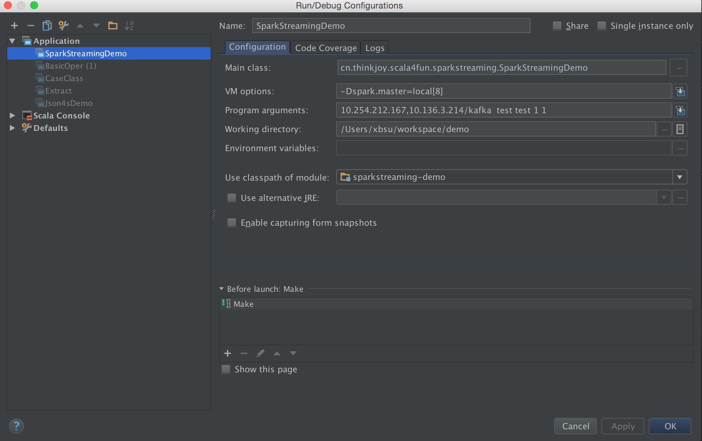

#spark streaming
从kafka读取数据，通过spark streaming处理，并确保可靠性，可在实际应用中使用。

接收模型
```scala
val ssc:StreamingContext=???
val kafkaParams:Map[String,String]=Map("group.id"->"test",...)
val readParallelism=5
val topics=Map("test"->1)

//启动5个接收tasks
val kafkaDStreams = (1 to readParallelism).map{_ =>
  KafkaUtils.createStream[String, String, StringDecoder, StringDecoder](
    ssc, kafkaParams, topicMap, StorageLevel.MEMORY_AND_DISK_SER_2)
  }

val unionDStream = ssc.union(kafkaDStreams)

//一个DStream，20个partition
val processingParallelism=20
val processingDStream = unionDStream(processingParallelism)
  
```

idea调试过程中，application配置文件的配置如下：


测试命令

```scala
spark-submit --master local[5] --class cn.thinkjoy.utils4s.sparkstreaming.SparkStreamingDemo sparkstreaming-demo-1.0-SNAPSHOT-jar-with-dependencies.jar 10.254.212.167,10.136.3.214/kafka  test test 1 1
```

在实际环境中，只需去掉 `--master local[5]`